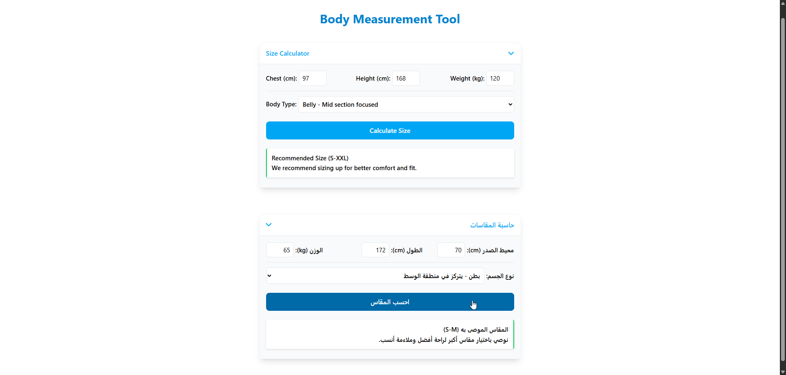

# Body Measurement Size Calculator

**[Live Preview](https://www.mhdeveloper.com/projects/body-measurement-calculator)**

## Description

A smart, vanilla JavaScript-powered size calculator that recommends the perfect clothing size (S–XXXL) based on comprehensive body measurements. This tool analyzes chest measurements, height, weight, and body type to provide accurate size recommendations with detailed explanations.

## Features

- **Intelligent Sizing Algorithm** - Calculates optimal size based on multiple body metrics
- **Body Type Consideration** - Adjusts recommendations based on where fat is concentrated (chest, belly, or balanced)
- **BMI Integration** - Uses Body Mass Index for more accurate sizing
- **Height-Weight Ratio Analysis** - Considers proportions for better fit recommendations
- **Detailed Feedback** - Provides explanations for each recommendation
- **Pure Vanilla JavaScript** - No frameworks
- **Responsive Design** - Works seamlessly on all devices

## How It Works

1. Enter your chest measurement in centimeters
2. Input your height in centimeters
3. Provide your weight in kilograms
4. Select your body type (chest-focused, belly-focused, or balanced)
5. Click "Calculate Size" to get your recommended size with detailed reasoning

## Technologies Used

- HTML5
- CSS3 (Tailwindcss)
- Vanilla JavaScript (ES6+)

2. Open `src/index.html` in your browser

That's it! No build process or dependencies needed.

## Usage

Simply open the calculator and fill in your measurements. The algorithm will:
- Analyze your chest measurement as the primary sizing factor
- Consider your height and weight proportions
- Apply body-type specific adjustments
- Provide a size recommendation (S, M, L, XL, XXL, or XXXL)
- Explain why that size was recommended

## Customization

You can easily customize the sizing thresholds in the `calculateSize()` function to match your specific brand's size chart.

## Author

**Mohamed Hassan**  
Web Developer  
[www.mhdeveloper.com](https://www.mhdeveloper.com)

---

⭐ If you find this tool helpful, please consider giving it a star on GitHub!